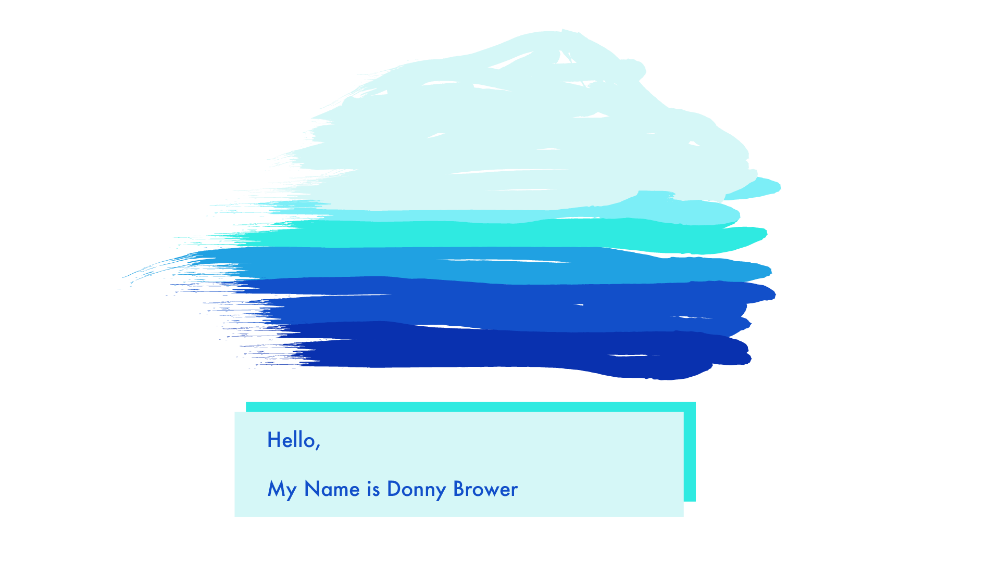

## {{ title }}

Hello my beloved fans,

The year keeps passing me by, like the angels from the song _Angels_. Time to sound my bells. 

---

### Progress on frontend-masters

A big one for 2021 has been the time I've spent learning in Frontend Masters courses. I've taken:

- Complete Intro to React v5
- CSS Grids and Flexbox for Responsive Web Design
- Javascript: From Fundamentals to Functional JS v2
- Javascript: The Hard Parts v2
- A Practical Guide to Algorithms with Javascript
- Deep Javascript Foundations v3
- Javascript: The Recent Parts

A snapshot of what I've learned:

- How flex parents and children work; how the different CSS rules associated with parents and children affect layouts

- How to define a grid using the different grid syntaxs; how to control the sizing and placement of grid elements, and grid tracks.

- How to create a React application using the Parcel bundler and set it up to use packages to enhance code quality and developer experience.

- How to build functional and class based React componenets that do things like change state and react to user input and make requests to third party apis

- How to trace the evaluation of a program and analyize a programs effects as it progresses

- how to pollyfill standartlib funtctions like .forEach, map, filter, reduce, sort

- how to do a linear search or a binary search

- how to understand an algorithms big-o

- how to do a bubblesort or a mergesort

- how to think about the idea closure, variable environemnt and execution context, and persistent lexically scoped reference data [[scope]], and higher order functions]

- how to use the module pattern in when designing programs.

- 

---

Interrupting! Made my first 'color pallete' on Illustrator:

The colors kind of work!

- [color palletes](https://www.youtube.com/watch?v=u5AnzLg1HxY)
- [color tips](https://www.youtube.com/watch?v=C1rQQ_YpgcI)
- [applying color to a design](https://www.youtube.com/watch?v=eXcKOqviLE0)

---

(back to talking about the year):

